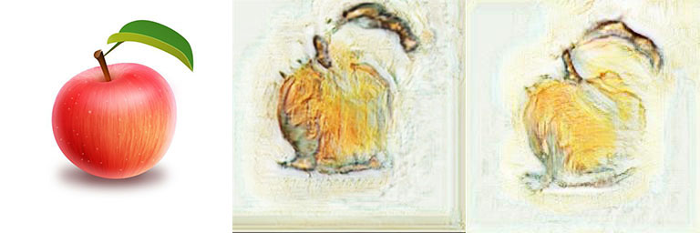
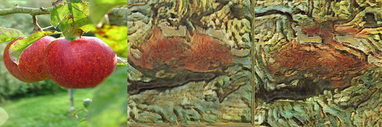
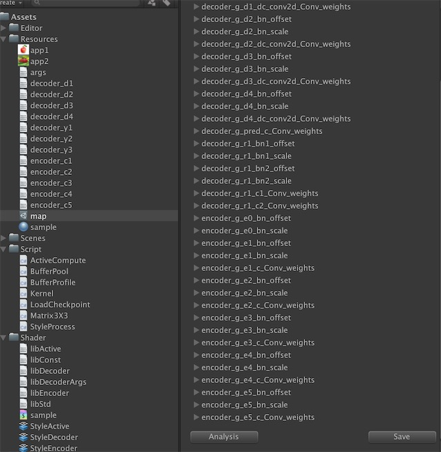

# Style-transfer Nearual Network

[中文版](./readme-cn.md)

The project aimed to transfer style  realtime in the video game. 

We trained the model in the tensorflow, and forward the network in the unity environment.

<br> <br>


<br> <br>

As shown in the picture，left is origin picture, middle is unity transfer picture, and right is tensorflow inference picture.


## Environment

Unity2018.2 	<br>
Python2.7 or 3.5 <br>
Tensorflow 1.7 or new <br>
PIL, numpy, scipy, cv2 <br>
tqdm

## Export Data

### run the command like this:

```sh
python main.py \
         --model_name=model_van-gogh \
         --phase=export_arg \
         --image_size=256
```

You will find *args.bytes* generated in the unity/Assets/Resources/ directory. 

The file is store arguments about neural network trained in the tensorflow.

Note: The file format is not protobuf, defined self.

preprocess the bytes to generate map.assets for efficiency。 Open the Unity Env,

run Tools->GenerateMap, the file will be generated.


<br><br>

click the analysis button, the file will be filled with arg.bytes map info. And click the save button, the map will be serialzed to disk from memory.


###  Export neural network layer to unity env, use the command like this:

```sh
python main.py \
         --model_name=model_van-gogh \
         --phase=export_layers \
         --image_size=256
```


You can also download this dataset from [baidu clound disk](https://pan.baidu.com/s/13_kSWE-OiqHFDXix9NwL_g), and import to unity env.

If you visual layer data as image, you can use tool in unity, and click Tools->LayerVisual, Then you will get tool like this:


<br><br>

### preview effect in python env, use the command:


```sh
python main.py \
         --model_name=model_van-gogh \
         --phase=inference \
         --image_size=256
```

The generated picture will be placed in model folder.


## Training 

Content images used for training:  [microsoft coco dataset train mages (13GB)](http://mscoco.org)。  
Style images used for training the aforementioned models: [download link](https://hcicloud.iwr.uni-heidelberg.de/index.php/s/NcJj2oLBTYuT1tf).    
Query style examples used to collect style images: [query_style_images.tar.gz](https://yadi.sk/d/5sormJouqyuI4A).

1. Download and extract style archives in folder `./data`.   
2. Download and extract content images.
3. Launch the training process (for example, on van Gogh):

```
CUDA_VISIBLE_DEVICES=1 python main.py \
                 --model_name=model_van-gogh-new \
                 --batch_size=1 \
                 --phase=train \
                 --image_size=256 \
                 --lr=0.0002 \
                 --dsr=0.8 \
                 --ptcd=/data/micro_coco _dataset \
                 --ptad=./data/vincent-van-gogh_road-with-cypresses-1890
```

## Comment

In encoder or decoder network, group will be satisfied with thread-z at first. 

Due to limit 64 on thread-z, we exchange thread-x and thread-z on batch-normal stage.

However, thread-x is alse limited 1024 in compute shader.

During the train, arg model_name is different the inference, otherwise you will start with the trained model.


## Active Function

open this project with unity2018, then you can see all active function implments in the scene named ActiveFunc.

Run the unity, and click the button named *Active function*, you will see the behaviour like this:

<br><br>

We drawed the 3 kinds of active function used R G B chanel.

R stands for relu, G stands for sigmod, while B stands for tanh.


## Contact

Email: peng_huailiang@qq.com

Blog:  https://huailiang.github.io/