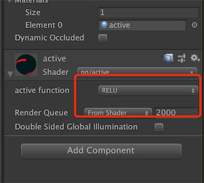

# Shader Nearual Network

## Version

Unity2018.2 (MacOS  & Windows)

## Active Function

open this project with unity2018.2, then you can see all active function implments in the scene named ActiveFunction.

open the scene ActiveFunction, then select active function mode, such as tanh:

  

wait for a moment, and  you will look effect like this :

  

all active function: relu, lrelu, tanh, sigmod.

## Contact

Email: peng_huailiang@qq.com

Blog:  https://huailiang.github.io/