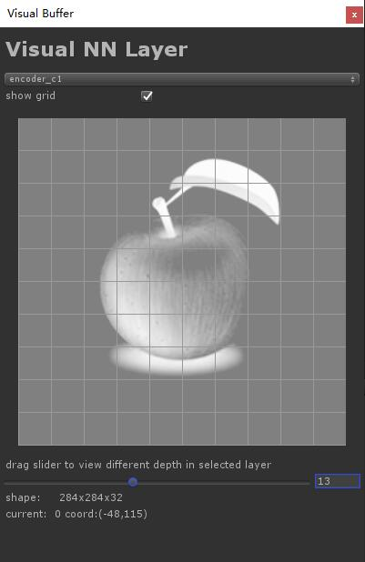
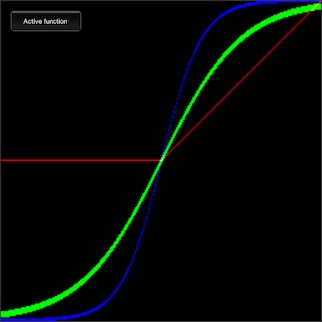

# Style-transfer Nearual Network

The project aimed to transfer style  realtime in the video game. 

We trained the model in the tensorflow, and forward the network in the unity environment.


## Environment

Unity2018.2 

Python2.7 or 3.5 

Tensorflow 1.7 or new


## Export Data

### run the command like this:

```sh
python main.py \
         --model_name=model_van-gogh \
         --phase=export_arg \
         --image_size=256
```

You will find *args.bytes* generated in the unity/Assets/Resources/ directory. 

The file is store arguments about neural network trained in the tensorflow.

The file format is not protobuf, defined self.


###  Export neural network layer to unity env, use the command like this:

```sh
python main.py \
         --model_name=model_van-gogh \
         --phase=export_layers \
         --image_size=256
```

If you visual layer data as image, you can use tool in unity, and click Tools->LayerVisual, Then you will get tool like this:


<br><br>

### preview effect in python env, use the command:


```sh
python main.py \
         --model_name=model_van-gogh \
         --phase=inference \
         --image_size=256
```

The generated picture will be placed in model folder.


## Comment

If encoder or decoder network, group will be z's thread at first. 

For example,  `StyleNormal1` in encoder thread-z is set as 32 at first. and thread-y must be less than 32, because of max threads is 1024, that is 32x32. But the layer is 284x284x32, so scale is 284/32 = 8, while width is set 32.

if thread-z more than 64, width should be set 1024/depth, for example `StyleNormal5` shape is 16x16x256, width is 1024/256 = 4, scale = 16 / 4 = 4.
This is due to g_cache limited.


## Active Function

open this project with unity2018.2, then you can see all active function implments in the scene named ActiveFunction.

Run the unity, and click the button named *Active function*, you will see the behaviour like this:

<br><br>

We drawed the 3 kinds of active function used R G B chanel.

R stands for relu, G stands for sigmod, while B stands for tanh.


## Contact

Email: peng_huailiang@qq.com

Blog:  https://huailiang.github.io/